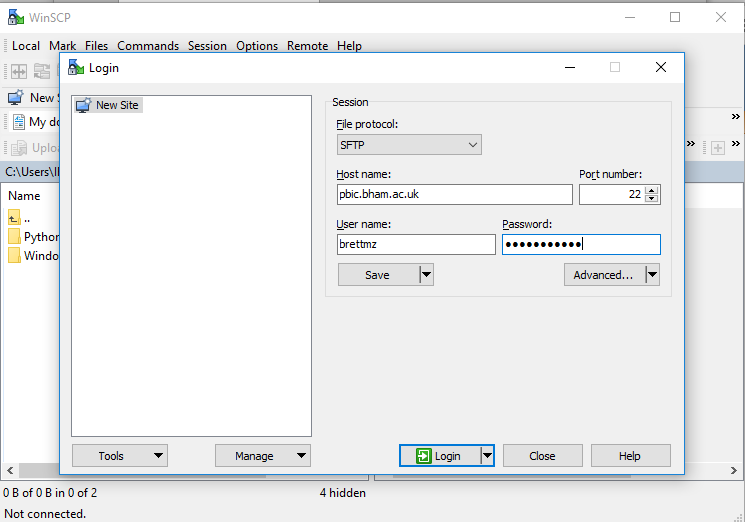

# Frequently asked questions for 2018 Assessment B

Feel free to propose edits or new questions for this FAQ.

You can do that by email to <m.brett@bham.ac.uk>, or for cool points, use the
pen icon at the top right of the page to make and propose your edits.  You'll
need a Github account for that, but that's a good thing to do in any case.

## Do I have to copy the data? or Why am I getting permission errors?

You have a folder called `replication` in your home directory, and that has a
link named `data`, which points to `/home/data/FBI/assessment`.  That
directory is read-only - so you cannot save anything into the
`/home/data/FBI/assessment` directory, and therefore, you can't save anything
in your `replication/data` directory.

This might be annoying, because when you run tools like BET or FEAT, the
default output image or directory matches the input data.  For example, if you
try to run BET on the image
`/home/data/FBI/assessment/ds107/sub-01/anat/sub-01_T1w` - then the
default output image will be
`/home/data/FBI/assessment/ds107/sub-01/anat/sub-01_T1w_brain`.
Another pointer to the same place is
`/home/people/xxx/replication/data/ds107/sub-01/anat/sub-01_T1w_brain`
where `xxx` is your username.   You have two options:

1.  Copy the entire data folder to another directory in your home directory
    space.  We don't recommend this, because it will take up a lot of space,
    and you may run out of space when doing your analysis.
2.  Set the output files and directories to point into your home space.  For
    example, for the BET output above, you could make an output directory like
    this:

        # Make a directory to put files for this subject
        mkdir -p ~/replication/analysis/sub-01/anat

    and then use an output filename like
    `/home/people/xxx/replication/analysis/sub-01/anat/sub-01_T1w_brain`

## Do I need to reorient the structural images?

Have a look at the structural files with `fsleyes` - are they in the correct
orientation?  Or they they sagittal images like you had in the workshop?  You
need to reorient if they are not already in the correct orientation.

## What is spatial smoothing?

See: https://matthew-brett.github.io/teaching/smoothing_intro.html

## Slice timing

You may want to do slice timing on your first-level analyses.

Duncan *et al* do not refer to slice timing in their write-up, but you may
prefer to put it into your pipeline.

Slice timing adjusts the functional scans for the fact that the scanner
collects the slices one by one, so the last slice that the scanner collects is
nearly one TR in time after the first slice in the volume.

One way of adjusting for this, is by interpolating the scan data in time, to
get an estimate of what the voxel values would have been, if they had all been
collected at the same time.

See my [slice timing
tutorial](http://matthew-brett.github.io/teaching/slice_timing.html) for an
introduction.

First you will need to know what order the scanner collected the slices in your
data.   The original functional images, from which the experimenters made the
OpenFMRI copies, had this information in their [NIfTI
header](https://nifti.nimh.nih.gov/nifti-1).  They all had the header field
named `slice_code` set to 3, which signifies "alternating increasing".  This
means that the scanner collected the bottom slice first (call that slice 1),
then the third-from-bottom (slice 3), all the way up to slice 35, and then
returned to collect slice 2, 4 and so on.

To do the slice-timing correction in FSL, see the [FEAT User
Guide](https://fsl.fmrib.ox.ac.uk/fsl/fslwiki/FEAT/UserGuide).

## How did you create the event .txt files?

The OpenFMRI data does not not come with the `.txt` files giving the onset,
duration and amplitude information for each event type.  I created these files
from the overall event definition files for each task.

For example, here are a listing of the `.txt` files for subject 01:

```
sub-01/func/sub-01_task-onebacktask_run-01_label-objects.txt
sub-01/func/sub-01_task-onebacktask_run-01_label-scrambled.txt
sub-01/func/sub-01_task-onebacktask_run-01_label-strings.txt
sub-01/func/sub-01_task-onebacktask_run-01_label-words.txt
sub-01/func/sub-01_task-onebacktask_run-02_label-objects.txt
sub-01/func/sub-01_task-onebacktask_run-02_label-scrambled.txt
sub-01/func/sub-01_task-onebacktask_run-02_label-strings.txt
sub-01/func/sub-01_task-onebacktask_run-02_label-words.txt
```

I used a Python script to generate these files from the source files:

```
sub-01/func/sub-01_task-onebacktask_run-01_events.tsv
sub-01/func/sub-01_task-onebacktask_run-02_events.tsv
```

I will soon publish the script that I used to do this.

As you will see from that script, I had to write small algorithms to analyze
the events, and select the ones corresponding to the individual trial types.

## Which images should I refer to in my report?

In your output directory for each task, you will likely have image maps with
names like `thresh_zstat1.nii.gz` and `rendered_thresh_zstat1.nii.gz`.  The
`rendered` image is a special image optimized for display with FslEyes.
Prefer the `thresh_zstat` image when you are choosing images to point to for
your report.

## How do I copy my Word / other files from my laptop to the cluster?

### On Windows

  * Go to: https://winscp.net/eng/download.php
  * Download and install the "Installation package".  Choose all the default
    options.
  * Start WinSCP and enter your details to log into the cluster, like this:

    

    Obviously you'll need your own username, instead of mine, which is
    `brettmz`.

  * A new window with two panes will open.  The left hand pane refers to your
    laptop, the right to the filesystem on the cluster.  Use the left pane to
    navigate to the directory containing the file you want to upload, then
    drag it to the `replication` directory in the right pane.

### On Mac

  * Open Terminal.app.  You now have a terminal running on your Mac.  Make
    sure that you haven't accidentally picked up a Terminal.app session that
    is already logged into the cluster, by typing `hostname`.  It should show
    the name of your Mac, and not `pbic.bham.ac.uk`.
  * Use `cd` to navigate to the directory containing the file you want to
    upload.  For example, if you document was in the `Documents` folder in
    your home directory, you could type `cd ~/Documents`.  If you're stuck
    working out how to get to that directory, try opening a Finder window,
    then navigate to the directory containing the file you want to transfer,
    and drag the file to the Terminal window.  It's path (position on the file
    system) should appear in the Terminal window.
  * Use `scp` to copy the file to the cluster - e.g.

    ```
    scp README.docx xxx@pbic.bham.ac.uk:replication
    ```

    where `xxx` is your username.

    This will copy the `README.docx` file to the `replication` directory on
    the server.  The server will ask for your password.

